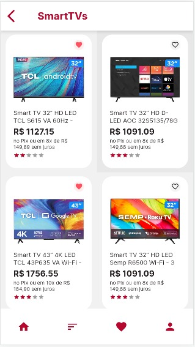
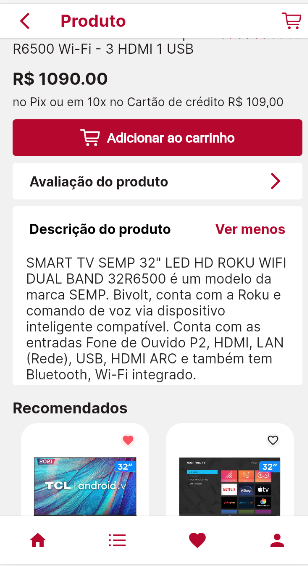

<div align="star">
     
</div>

## Aplicativo E-commerce em Flutter:


Bem-vindo ao Ladies.com! 

Nosso aplicativo e-commerce desenvolvido em Flutter.

O aplicativo oferece acesso fácil a uma variedade de eletroeletrônicos, smartTVs e smartphones.


## 1 Task Hackadev - E-commerce - Front-End (Flutter)

* Página Home;
* Listagem de todos os produtos;
* Listar 3 categorias principais: (Eletroeletrônicos, SmartTVs e Smartphones);
* Menu de navegação (Tab Navigation Bottom).


<div align="center">
  
  
  
  
</div>

## 2 Task Hackadev - Criação de Layout de Tela do Produto - Front-End (Flutter)

* Descrição do Produto;

* Valor (pagamento, parcelamento etc);

* Avaliação de Clientes;

* Produtos Recomendados.


<div align="center">
  
  
  
</div>


## 3 Task Hackadev - Consumo de API

Consumo de API, utilizando o json-server para criar uma API.

* Efetuar o cadastro de produtos;
* Listar todos os produto;
* Detalhar um produto através do id (código). Ao clicar em um produto, deverá ser feita uma requisição através do código para retornar todos os dados daquele produto (nome, valor, imagens, fabricante, descrição, comentários, etc…)

<div align="center">
  
  
  
  
</div>


## 4 Task Hackadev - Ecommerce - Backend + Banco de Dados Oracle

Implementar um sistema para gerenciar produtos, contendo as seguintes funcionalidades:

* Cadastro de produtos (incluíndo o upload de imagens)
* Seleção de todos os produtos e exibição dos mesmos através de categorias no APP.
* Dispor a opção para realizar a atualização de dados dos produtos.
* Possibilitar a remoção de produtos.
* Na página inicial da aplicação, disponibilizar uma opção para pesquisar os produtos através de um termo.

Regras

Utilização de banco de dados Oracle.

Backend trabalhando juntamente com PHP + Lavavel.

<div align="center">
  
  
  
</div>


### Ferramentas utilizadas: 

* Figma

* Trello

* Vscode

* Banco de Dados Oracle

* Insomnia

  

### Tecnologias: 

* Flutter

* Dart

* Laravel

  

### Para obter o Projeto:
Clone o repositório e no terminal execute os seguintes comandos:
```
flutter pub get
flutter run
```


### Autores:

<table>
  <tbody>
    <tr>
      <td align="center" valign="top">  <a href="https://github.com/anapaulaguimaraes"> 
          <br /> <sub>Monitora</sub> <p>Ana Paula</p> </a>
      </td>
	<td align="center" valign="top">  <a href="https://github.com/IsisPedroni"> 
          <br /> <sub>Vice-Monitora</sub> <p>Ísis Pedroni</p> </a>
      </td>
	<td align="center" valign="top">  <a href="https://github.com/laisa-alves"> 
          <br /> <p>Laísa Alves</p> </a>
      </td>
	<td align="center" valign="top">  <a href="https://github.com/GrasieleRocha"> 
          <br /> <p>Grasiele</p> </a>
      </td>
	<td align="center" valign="top">  <a href="https://github.com/marianadefatima"> 
          <br /> <p>Mariana</p> </a>
      </td>
	    <td align="center" valign="top">  <a href="https://github.com/polysaantana"> 
          <br /> <p>Polyanna</p> </a>
      </td>
      </td>
    </tr>
  </tbody>
</table>
