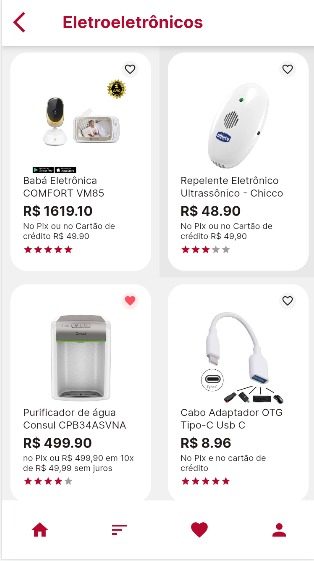
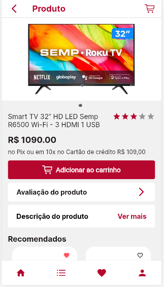
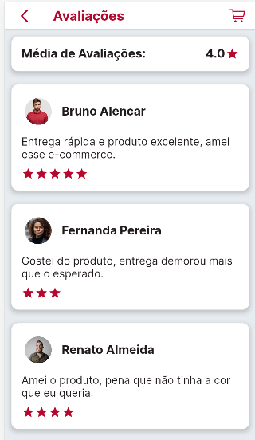

<div align="star">
     
</div>

## Aplicativo E-commerce em Flutter:


Bem-vindo ao Ladies.com! 

Nosso aplicativo e-commerce desenvolvido em Flutter.

O aplicativo oferece acesso fácil a uma variedade de eletroeletrônicos, smartTVs e smartphones.


## 1 Task Hackadev - Imagens do aplicativo 

* Página Home;
* Listagem de todos os produtos;
* Listar 3 categorias principais: (Eletroeletrônicos, SmartTVs e Smartphones);
* Menu de navegação (Tab Navigation Bottom).


<div align="center">
  
  
  
  
</div>

## 2 Task Hackadev - Imagens do aplicativo 

* Descrição do Produto;

* Valor (pagamento, parcelamento etc);

* Avaliação de Clientes;

* Produtos Recomendados.


<div align="center">
  
  
  
</div>

### Ferramentas utilizadas: 

* Figma

* Trello

* Vscode

  

### Tecnologias: 
* Flutter

* Dart

  

### Para obter o Projeto:
Clone o repositório e no terminal execute os seguintes comandos:
```
flutter pub get
flutter run
```


### Autores:

<table>
  <tbody>
    <tr>
      <td align="center" valign="top">  <a href="https://github.com/anapaulaguimaraes"> 
          <br /> <sub>Monitora</sub> <p>Ana Paula</p> </a>
      </td>
	<td align="center" valign="top">  <a href="https://github.com/IsisPedroni"> 
          <br /> <sub>Vice-Monitora</sub> <p>Ísis Pedroni</p> </a>
      </td>
	<td align="center" valign="top">  <a href="https://github.com/laisa-alves"> 
          <br /> <p>Laísa Alves</p> </a>
      </td>
	<td align="center" valign="top">  <a href="https://github.com/GrasieleRocha"> 
          <br /> <p>Grasiele</p> </a>
      </td>
	<td align="center" valign="top">  <a href="https://github.com/marianadefatima"> 
          <br /> <p>Mariana</p> </a>
      </td>
	    <td align="center" valign="top">  <a href="https://github.com/polysaantana"> 
          <br /> <p>Polyanna</p> </a>
      </td>
	<td align="center" valign="top">  <a href="https://github.com/divina37"> 
          <br /> <p>Divina</p> </a>
      </td>
    </tr>
  </tbody>
</table>
